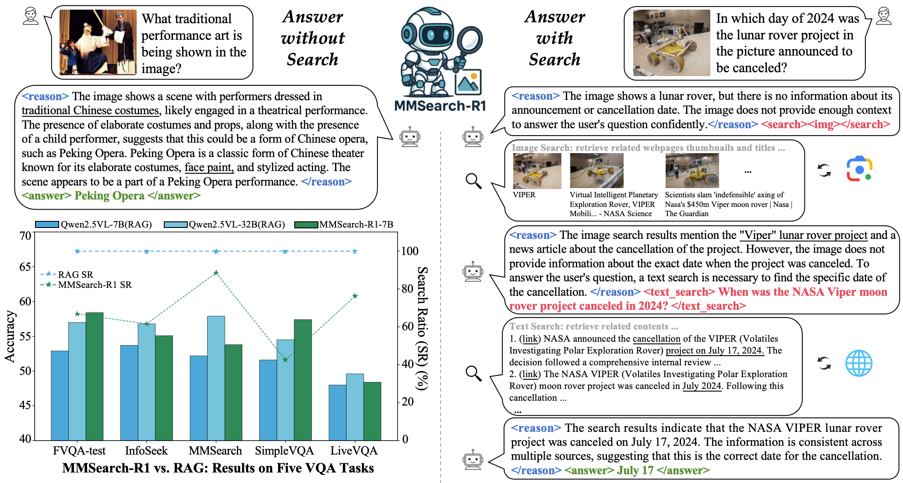

<h1 align="center">Multimodal-Search-R1: Incentivizing LMMs to Search</h1>

<p align="center">
  <a href="https://arxiv.org/abs/2506.20670">Paper</a> ｜ 
  <a href="https://www.lmms-lab.com/posts/mmsearch_r1">Blog</a> ｜
  <a href="https://huggingface.co/lmms-lab/MMSearch-R1-7B">Model</a> ｜
  <a href="https://huggingface.co/datasets/lmms-lab/FVQA">Data</a>
</p>

## Overview
<p align="center">
  
</p>

**MMSearch-R1** is an end-to-end RL framework that enables LMMs to perform on-demand, multi-turn search with real-world multimodal search tools.

## News
- [25.07.30] [MMSearch-R1-7B](https://huggingface.co/lmms-lab/MMSearch-R1-7B) Model and [FactualVQA(FVQA)](https://huggingface.co/datasets/lmms-lab/FVQA) Dataset **(including all cached image search results)** now released on [Huggingface](https://huggingface.co/collections/lmms-lab/mmsearch-r1-6889e975d8651ce2554b1b3e)!
- [25.06.26] Paper released on [ArXiv](https://arxiv.org/abs/2506.20670) and [Huggingface](https://huggingface.co/papers/2506.20670)!
- [25.06.18] [Blog](https://www.lmms-lab.com/posts/mmsearch_r1) and code are updated!

## Table of Content
- [Installation](#installation)
- [Multimodal Search Tool Implementation](#multimodal-search-tool-implemention)
- [Data Construction](#data-construction)
- [Train & Eval](#train--eval)

## Installation
```bash
# Clone this repo with submodules
git clone --recurse-submodules https://github.com/EvolvingLMMs-Lab/multimodal-search-r1.git
cd multimodal-search-r1
# Init Conda Env
conda create -n mmsearch_r1 python==3.10 -y
conda activate mmsearch_r1
# Install Dependencies
pip3 install -e ./verl
pip3 install vllm==0.8.2
pip3 install transformers==4.51.0
pip3 install flash-attn==2.7.4.post1
# Init wandb
pip3 install wandb
export WANDB_API_KEY="XXX"
wandb login $WANDB_API_KEY
```

## Multimodal Search Tool Implemention
We draw inspiration from open-sourced implementation [OpenDeepResearcher](https://github.com/mshumer/OpenDeepResearcher/blob/main/open_deep_researcher.ipynb), which integrates [SerpApi](https://serpapi.com/), [JINA Reader](https://jina.ai/reader/), and LLM-based summarization to retrieve and condense web content relevant to a given question. Currently, MMSearch-R1 includes two types of search tools: an image search tool and a text search tool.
- **Image Search Tool:** This tool is built solely on SerpAPI. The model provides the image (via URL or other form) to the tool, which is responsible for retrieving the top-k visually relevant web pages. The tool returns a sequence of interleaved thumbnails and titles extracted from those pages.
- **Text Search Tool:** This tool combines SerpAPI, JINA Reader, and Qwen3-32B for summarization. The model submits a text query, and SerpAPI retrieves the top-k relevant web page URLs. JINA Reader parses and cleans the content of those pages, and Qwen3-32B generates summaries based on the original query. The tool ultimately returns a list of summarized passages from the top-k relevant webpages with their respective links.

⚠️⚠️⚠️ Before initiating formal training, you are expected to build your own search tool pipeline under the `mmsearch_r1/utils/tools/` directory and invoke it appropriately during the multi-turn rollout process.

## Data Construction
Both the training and validation datasets follow the format defined by veRL. We provide an example dataset under directory `mmsearch_r1/data` as a reference to help you prepare your own training data.

## Train & Eval
We recommend use the command below for unified training and evaluation:
```bash
bash mmsearch_r1/scripts/run_mmsearch_r1_grpo.sh
```
We highlight the important configurations for training the Multi-Round Search LMMs:
- `actor_rollout_ref.rollout.name`: should be `vllm_multiturn_mmsearch` for multi-turn search rollout;
- `actor_rollout_ref.actor.use_multi_turn_response_mask`: should be `True`, as we use it to refine the original `response_mask` for accurate loss calculation.
- `actor_rollout_ref.rollout.max_gen_round`: The max number of turns during rollout;
- `data.max_response_length`: The max response length for each turn;
- `actor_rollout_ref.rollout.response_length_total`: The max conversation length for all turns (except the user prompt in the first turn);

For evaluation only, configure these parameters in the above script:
```bash
...
trainer.val_files=${path_to_val_data} \
trainer.val_only=True \
trainer.val_only_save_dir=${path_to_save_dir} \
trainer.val_generations_to_log_to_wandb=64 # num of val generations to log, this should be larger than the size of val dataset for complete saving
```
The model's responses will be saved in JSON format under `${path_to_save_dir}`, which can be used for subsequent analysis and evaluation.

## ToDo
- [x] Model and Datasets
- [x] Inference script example

## Acknowledgement
We sincerely thank these repositories for providing helpful open-source resources: [Qwen2.5-VL](https://github.com/QwenLM/Qwen2.5-VL), [veRL](https://github.com/volcengine/verl), [OpenDeepResearcher](https://github.com/mshumer/OpenDeepResearcher), [cfpark00/verl](https://github.com/cfpark00/verl/tree/multi_turn_rollout), [Search-R1](https://github.com/PeterGriffinJin/Search-R1), [MMSearch](https://github.com/CaraJ7/MMSearch).

## Citation
```
@article{wu2025mmsearch,
  title={MMSearch-R1: Incentivizing LMMs to Search},
  author={Wu, Jinming and Deng, Zihao and Li, Wei and Liu, Yiding and You, Bo and Li, Bo and Ma, Zejun and Liu, Ziwei},
  journal={arXiv preprint arXiv:2506.20670},
  year={2025}
}
```
